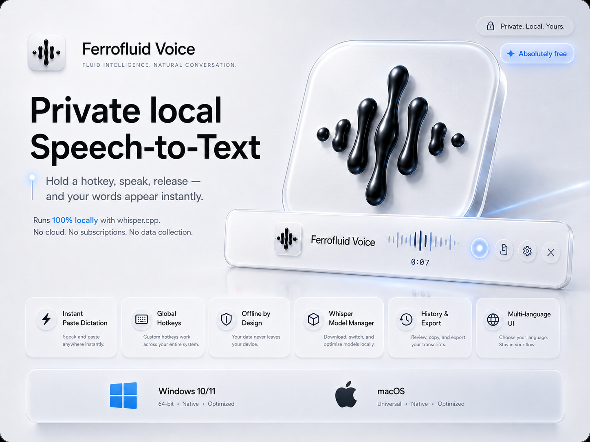

# 🧠 Ferrofluid Voice



[](https://opensource.org/licenses/MIT)
[](https://tauri.app/)
[](https://www.rust-lang.org/)
[](#)

**Ferrofluid Voice** is a modern, privacy-first, ultra-lightweight desktop dictation and transcription utility. It runs **100% locally** on your machine using `whisper.cpp` (GGML models), converting your voice to text and pasting it directly into your active cursor position instantly when you release your hotkey.

No cloud APIs, no subscriptions, no data collection. Just high-speed, local speech-to-text.

---

## ✨ Features

- **⚡ Instant Paste Dictation**: Hold your hotkey, speak, release—and watch your words automatically type themselves into your current text editor, chat, or browser field.
- **🎧 Zero-Dependency Portability (Windows)**: Bundled with Microsoft Visual C++ Runtime libraries (`vcruntime140.dll`, `msvcp140.dll`, and `vcruntime140_1.dll`) out-of-the-box. Works on fresh Windows 10/11 installations without forcing the user to install any runtimes.
- **🍎 Full macOS Native Integration**: Uses CoreGraphics Event Taps (`CGEventTap`) and AppleScript focus restoration for native global hotkey triggering and text injection on macOS.
- **🖱️ Universal Hotkey Triggers**: Map your global dictation hotkey to any keyboard key (including modifiers like Shift/Ctrl/Cmd/Caps Lock) or mouse buttons (Middle Click, Side Button 4, Side Button 5).
- **🌍 Dynamic Interface & Multi-language Support**: Sleek, glassmorphic settings panel localized in 5 languages: **English**, **Russian**, **Ukrainian**, **Spanish**, and **Chinese**.
- **📦 In-App Whisper Model Manager**: Browse, download, cancel, and switch between Whisper models (`Tiny`, `Base`, `Small`, `Medium`, `Large v3 Turbo`, `Large v3`) with real-time download progress bar indicators.
- **📚 Local History & Exports**: SQLite-powered transcription history with search and export capabilities.

---

## 🛠️ Architecture

Ferrofluid Voice is engineered for minimal resource consumption and fast execution:
- **Core Engine**: Built on **Tauri 2** and **Rust** for native system access, threading, and low-level global hooks.
- **Frontend**: **React**, **Vite**, **TypeScript**, and **CSS Variables** with premium dark glassmorphism effects.
- **Audio Capturing**: Native device capture utilizing Rust's `cpal` and WAV encoding via `hound`.
- **Database**: SQLite integration using `rusqlite` for historical data storage.
- **Key Injection**: 
  - Windows: Win32 API (`SendInput` and `SetForegroundWindow`).
  - macOS: CoreGraphics Framework (`CGEventCreateKeyboardEvent`, `CGEventPost`, and AppleScript process visibility hiding to safely return window focus).

---

## 🚀 Setup & Installation

### Requirements
- **Node.js** 20+ (for building frontend)
- **Rust** (stable toolchain)
- **Tauri 2** development prerequisites for your platform

### 1. Clone the repository
```bash
git clone https://github.com/your-username/ferrofluid-voice.git
cd ferrofluid-voice
```

### 2. Install dependencies
```bash
npm install
```

### 3. Run in development mode
For local development, point the app to a Whisper CLI executable:

**Windows (PowerShell):**
```powershell
$env:FERROFLUID_WHISPER_BIN="C:\path\to\whisper-cli.exe"
npm run tauri:dev
```

**macOS / Linux:**
```bash
export FERROFLUID_WHISPER_BIN="/path/to/whisper-cli"
npm run tauri:dev
```

### 4. Build Production Bundle
```bash
npm run tauri:build
```

The output installers (MSI/EXE on Windows, DMG/APP on macOS) will be generated under `src-tauri/target/release/bundle/`.

---

## ⚙️ Configuration & Permissions

### macOS Accessibility Permission
Global hotkeys and event interception require Accessibility Access on macOS. 
1. When launched, the app will request accessibility access.
2. If prompted, go to **System Settings ➔ Privacy & Security ➔ Accessibility**.
3. Toggle the switch to **ON** for **Ferrofluid Voice**.

### Local Models Storage
Whisper models are saved locally and can be accessed or managed through the Settings Panel.
- **Windows**: `%APPDATA%\Ferrofluid Voice\models\`
- **macOS**: `~/Library/Application Support/Ferrofluid Voice/models/`

---

## 📄 License

Ferrofluid Voice is distributed under the **MIT License**. See [LICENSE](LICENSE) for more details.

This project packages third-party dependencies. For their licensing terms (including Whisper.cpp, SDL2, CUDA Runtime, and MSVC Runtimes), please refer to [LICENSE-THIRD-PARTY.txt](LICENSE-THIRD-PARTY.txt).
